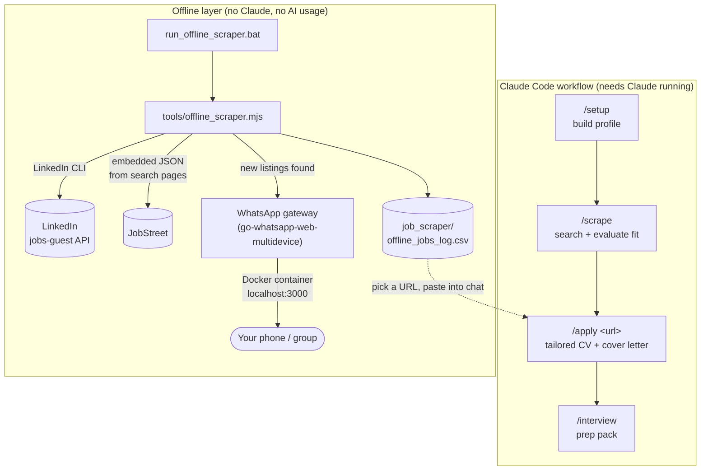

<p align="center">
  
</p>

# AI Job Search — Ahmad Fauzan Prayogi's Fork

*A Claude Code-powered internship search assistant, extended with an offline scraper and WhatsApp notifications.*

> Forked from [MadsLorentzen/ai-job-search](https://github.com/MadsLorentzen/ai-job-search), an independent open-source project not affiliated with Anthropic. Anthropic and Claude Code are referenced only to describe the toolchain this workflow uses.

## What this is

This repo runs a full internship-search pipeline for Ahmad Fauzan Prayogi (Electrical Automation Engineering, ITS Surabaya), combining two layers:

1. **The Claude Code workflow** (upstream framework) — profile setup, job evaluation, tailored CV/cover-letter generation, and interview prep, all run conversationally inside Claude Code.
2. **A custom offline layer** (`tools/`), built on top of the framework, that searches LinkedIn and JobStreet **without needing Claude open or any AI usage**, and can notify a WhatsApp number/group when new postings show up — via a self-hosted [go-whatsapp-web-multidevice](https://github.com/aldinokemal/go-whatsapp-web-multidevice) gateway running in Docker.

## How it fits together



Both layers read and write independent state on purpose: the offline scraper's dedup store (`job_scraper/offline_seen.json`) never touches the Claude-driven `/scrape` state (`job_scraper/seen_jobs.json`), so running one never corrupts the other.

## Requirements

| Tool | Used for | Notes |
|---|---|---|
| [Claude Code](https://claude.com/claude-code) | `/setup`, `/scrape`, `/apply`, `/interview`, etc. | The only component that needs an active Claude session / usage. |
| Python 3.10+ | `salary_lookup.py`, framework tooling | |
| [Bun](https://bun.sh) | LinkedIn search CLI, `tools/offline_scraper.mjs` | Install: `winget install Oven-sh.Bun` |
| LaTeX distribution (`lualatex` + `xelatex`) | Compiling the CV and cover letter | [MiKTeX](https://miktex.org/) on Windows; TeX Live/MacTeX/TinyTeX elsewhere. CV uses `lualatex`, cover letter uses `xelatex` (needs `fontspec`). |
| Optional: `pdftotext` ([poppler](https://poppler.freedesktop.org/)) | ATS text-layer check on the compiled CV | Degrades gracefully to a visual check if missing. |
| [Docker Desktop](https://www.docker.com/products/docker-desktop/) | Running the WhatsApp notification gateway | Only needed if you want WhatsApp alerts from the offline scraper — everything else works without it. |
| [go-whatsapp-web-multidevice](https://github.com/aldinokemal/go-whatsapp-web-multidevice) | The WhatsApp gateway itself | Runs as a Docker container, exposes a REST API on `localhost:3000`. |

## Quick start

### 1. Claude-driven workflow

```
claude
/setup      # build your profile (documents folder, single CV, or interview)
/scrape     # search LinkedIn + JobStreet, evaluated and ranked
/apply <url>  # tailored CV + cover letter for a specific posting
```

See [SETUP.md](SETUP.md) for the full walkthrough.

### 2. Offline scraper (no Claude needed)

Double-click:

```
tools\run_offline_scraper.bat
```

Searches LinkedIn + JobStreet for every keyword in `tools/offline_scraper.mjs` (`KEYWORDS`), skips anything already seen or already applied to (`job_search_tracker.csv`), and appends new listings to `job_scraper/offline_jobs_log.csv`. Fully offline — zero Claude/AI usage.

### 3. WhatsApp notifications (optional)

1. Start Docker Desktop.
2. Start the gateway:
   ```powershell
   cd "D:\bot wa\go-whatsapp-web-multidevice"
   docker compose up -d
   ```
3. Configure `.env` in this repo (copy from `.env.example`) with your target number(s)/group(s) — see the comments in the file for the exact format.
4. Run the offline scraper as normal. New listings get grouped by search keyword and sent as complete WhatsApp messages — nothing gets left out, and nothing gets sent twice (dedup is shared with the scraper's own "already seen" list).

Every send attempt (success or failure) is permanently logged to `job_scraper/whatsapp_log.csv` — proof of what was sent, when, and to whom. Set `WA_DRY_RUN=true` in `.env` to build and log messages without ever actually sending them, useful while testing configuration changes.

## Project structure

```
jobsearch/
├── CLAUDE.md                          # Candidate profile + workflow rules (read by every Claude command)
├── .claude/
│   ├── commands/                      # /apply, /setup, /rank, /interview, /outcome, ...
│   └── skills/
│       ├── job-application-assistant/ # Profile, behavioral, CV/cover-letter, interview-prep files
│       └── job-scraper/               # /scrape orchestration + search-queries.md
├── .agents/skills/                    # Job portal CLI tools (linkedin-search, freehire-search, ...)
├── cv/, cover_letters/                # LaTeX templates + generated tailored documents
├── documents/                         # Source materials for /setup and /expand
├── tools/
│   ├── offline_scraper.mjs            # Standalone LinkedIn + JobStreet scraper (no Claude)
│   └── run_offline_scraper.bat        # Double-click entry point for the offline scraper
├── job_scraper/                       # Scraper state and logs (gitignored - personal data)
│   ├── offline_jobs_log.csv           # Every new listing the offline scraper has found
│   └── whatsapp_log.csv               # Proof-of-send log for every WhatsApp notification attempt
├── .env / .env.example                # WhatsApp gateway config (target number/group, credentials)
├── job_search_tracker.csv             # Application tracking spreadsheet
└── SETUP.md                           # Detailed setup guide
```

## Collaboration

This is a personal internship-search workspace, not a general-purpose open-source project — but if you're helping out (a mentor reviewing applications, a classmate adapting this for their own search, or anyone picking up where this leaves off):

- **Personal data stays local.** Everything under `job_scraper/`, `.env`, generated CVs/cover letters (`cv/main_*.tex`, `cover_letters/cover_*.tex`), and `documents/` is gitignored on purpose. Never commit real contact details, application history, or WhatsApp credentials.
- **Forking this for your own search:** follow the upstream [MadsLorentzen/ai-job-search](https://github.com/MadsLorentzen/ai-job-search) setup, then treat `tools/offline_scraper.mjs` as an optional add-on — it's self-contained and doesn't require any of the WhatsApp/Docker pieces to be useful (LinkedIn + JobStreet search alone works standalone).
- **Proposing changes to the Claude-driven workflow** (commands, skills, templates): see the upstream [CONTRIBUTING.md](CONTRIBUTING.md) — it explains what belongs in a fork versus what's worth upstreaming.
- **Changes to the offline tooling** (`tools/offline_scraper.mjs`, the `.bat` files): these are fork-specific and don't need to follow the upstream contribution process. Keep edits self-documenting (inline comments over external docs) since this is meant to be readable and editable without deep JS knowledge — see the comment blocks at the top of each config section (`KEYWORDS`, `WA_*`) before changing behavior.
- **Reporting a problem:** if JobStreet stops returning results, check the console output for a `[blocked]` or `[jobstreet]` line first — it usually means Cloudflare is challenging the request, which is a known, self-healing limitation (see the comment above `fetchJobStreetPage` in `tools/offline_scraper.mjs`), not a bug to chase.

## Acknowledgements & Attribution

This is a **fork/derivative work**, not original code from scratch. The pieces below are used under their original authors' licenses, credited here so nothing in this repo misrepresents whose work it's built on:

| Component | Author | License | Used as |
|---|---|---|---|
| [MadsLorentzen/ai-job-search](https://github.com/MadsLorentzen/ai-job-search) | Mads Lorentzen | MIT | Base framework this repo is forked from — `.claude/`, `.agents/skills/`, CV/cover-letter templates, and the overall `/setup → /scrape → /apply` workflow are upstream's design, personalized here with Ahmad's own profile data. |
| [mikkelkrogsholm/skills](https://github.com/mikkelkrogsholm/skills) | Mikkel Krogholm | (see upstream repo) | Original job search CLI skill pattern that `.agents/skills/*` is built on (credited by upstream itself). |
| [go-whatsapp-web-multidevice](https://github.com/aldinokemal/go-whatsapp-web-multidevice) | Aldino Kemal | MIT | Self-hosted WhatsApp gateway (runs in Docker, unmodified) that `tools/offline_scraper.mjs` talks to for notifications — not bundled in this repo, run as a separate service. |
| [Claude Code](https://claude.com/claude-code) | Anthropic | Proprietary (referenced, not redistributed) | The agent this whole workflow runs inside of. |

**New work added in this fork** (not part of upstream): `tools/offline_scraper.mjs`, `tools/run_offline_scraper.bat`, `tools/start_whatsapp_gateway.bat`, the WhatsApp notification integration, `.env`/`.env.example`, and all personal profile content under `CLAUDE.md` and `.claude/skills/job-application-assistant/`.

## License

This repo is **MIT-licensed**, same as upstream — see [LICENSE](LICENSE). The file retains upstream's original copyright notice (`Copyright (c) 2026 Mads Lorentzen`) as MIT requires: that notice must stay in any copy or substantial portion of the software, forked or not. The additions listed above are also released under MIT.

The WhatsApp gateway (go-whatsapp-web-multidevice) is a **separate, unmodified dependency** run via Docker under its own MIT license (`Copyright (c) 2022 Aldino Kemal`) — it is not vendored or redistributed in this repo, only called over HTTP as an external local service.
