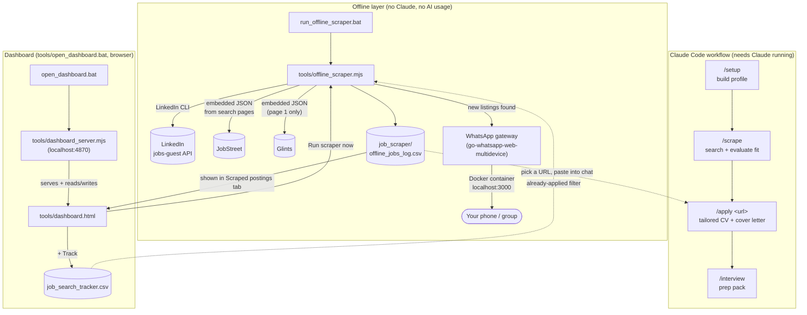
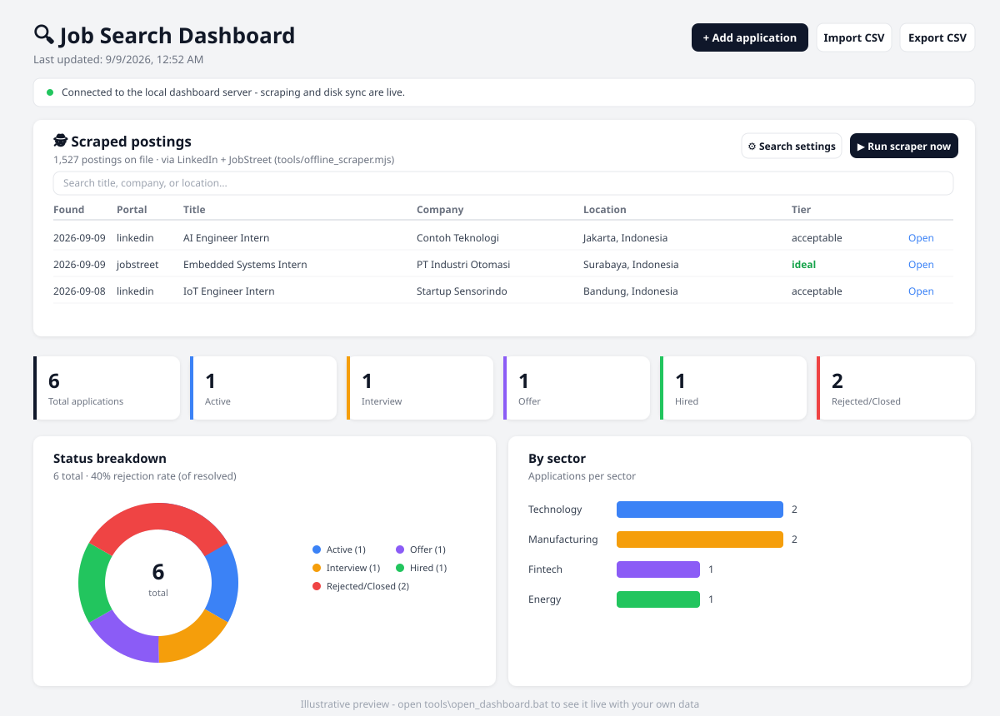

<p align="center">
  
</p>

# AI Job Search Dashboard

*An automated internship search assistant for Indonesia — LinkedIn + JobStreet + Glints scraping, application tracking, and WhatsApp alerts, now also as a standalone Android app, powered by Claude Code.*

**Built by [Ahmad Fauzan Prayogi](https://www.linkedin.com/in/ahmad-fauzan-prayogi-39653b1a7/)** — Electrical Automation Engineering student, ITS Surabaya.

<p align="center">
  
</p>

<p align="center">
  <a href="LICENSE"></a>
  <a href="https://www.linkedin.com/in/ahmad-fauzan-prayogi-39653b1a7/"></a>
  
  
  
  
  
</p>

> Forked from [MadsLorentzen/ai-job-search](https://github.com/MadsLorentzen/ai-job-search), an independent open-source project not affiliated with Anthropic. Anthropic and Claude Code are referenced only to describe the toolchain this workflow uses.

## What this is

This repo runs a full internship-search pipeline for Ahmad Fauzan Prayogi (Electrical Automation Engineering, ITS Surabaya), combining two layers:

1. **The Claude Code workflow** (upstream framework) — profile setup, job evaluation, tailored CV/cover-letter generation, and interview prep, all run conversationally inside Claude Code.
2. **A custom offline layer** (`tools/`), built on top of the framework, that searches LinkedIn, JobStreet, and Glints **without needing Claude open or any AI usage**, and can notify a WhatsApp number/group when new postings show up — via a self-hosted [go-whatsapp-web-multidevice](https://github.com/aldinokemal/go-whatsapp-web-multidevice) gateway running in Docker.

## How it fits together



The two automated layers (offline scraper, dashboard) read and write independent state from the Claude-driven `/scrape` on purpose: the offline scraper's dedup store (`job_scraper/offline_seen.json`) never touches `/scrape`'s own state (`job_scraper/seen_jobs.json`), so running one never corrupts the other. The dashboard sits on top of the offline layer rather than replacing it - it's a browser-based control panel for the exact same `tools/offline_scraper.mjs` and `job_search_tracker.csv` the `.bat` files and Claude-driven skills already use.

## Requirements

| Tool | Used for | Notes |
|---|---|---|
| [Claude Code](https://claude.com/claude-code) | `/setup`, `/scrape`, `/apply`, `/interview`, etc. | The only component that needs an active Claude session / usage. |
| Python 3.10+ | `salary_lookup.py`, framework tooling | |
| [Bun](https://bun.sh) | LinkedIn search CLI, `tools/offline_scraper.mjs`, `tools/dashboard_server.mjs` | Install: `winget install Oven-sh.Bun` |
| LaTeX distribution (`lualatex` + `xelatex`) | Compiling the CV and cover letter | [MiKTeX](https://miktex.org/) on Windows; TeX Live/MacTeX/TinyTeX elsewhere. CV uses `lualatex`, cover letter uses `xelatex` (needs `fontspec`). |
| Optional: `pdftotext` ([poppler](https://poppler.freedesktop.org/)) | ATS text-layer check on the compiled CV | Degrades gracefully to a visual check if missing. |
| [Docker Desktop](https://www.docker.com/products/docker-desktop/) | Running the WhatsApp notification gateway | Only needed if you want WhatsApp alerts from the offline scraper — everything else works without it. |
| [go-whatsapp-web-multidevice](https://github.com/aldinokemal/go-whatsapp-web-multidevice) | The WhatsApp gateway itself | Runs as a Docker container, exposes a REST API on `localhost:3000`. |

## Quick start

### 1. Claude-driven workflow

```
claude
/setup      # build your profile (documents folder, single CV, or interview)
/scrape     # search LinkedIn + JobStreet, evaluated and ranked
/apply <url>  # tailored CV + cover letter for a specific posting
```

See [SETUP.md](SETUP.md) for the full walkthrough.

### 2. Offline scraper (no Claude needed)

Double-click:

```
tools\run_offline_scraper.bat
```

Searches LinkedIn + JobStreet + Glints for every keyword in `job_scraper/scraper_config.json`, skips anything already seen or already applied to (`job_search_tracker.csv`), and appends new listings to `job_scraper/offline_jobs_log.csv`. Fully offline — zero Claude/AI usage. Glints is page-1-only per keyword (its own internal API handles pagination beyond that, which isn't reverse-engineered here); LinkedIn and JobStreet's page limits are configurable via Search settings.

### 3. WhatsApp notifications (optional)

1. Start Docker Desktop.
2. Start the gateway:
   ```powershell
   cd "D:\bot wa\go-whatsapp-web-multidevice"
   docker compose up -d
   ```
3. Configure `.env` in this repo (copy from `.env.example`) with your target number(s)/group(s) — see the comments in the file for the exact format.
4. Run the offline scraper as normal. New listings get grouped by search keyword and sent as complete WhatsApp messages — nothing gets left out, and nothing gets sent twice (dedup is shared with the scraper's own "already seen" list).

Every send attempt (success or failure) is permanently logged to `job_scraper/whatsapp_log.csv` — proof of what was sent, when, and to whom. Set `WA_DRY_RUN=true` in `.env` to build and log messages without ever actually sending them, useful while testing configuration changes.

### 4. Job tracker dashboard (browser UI for the whole pipeline)

Double-click:

```
tools\open_dashboard.bat
```

Starts a tiny localhost-only server (`tools/dashboard_server.mjs`, needs Bun) and opens `http://localhost:4870/` — a two-tab dashboard covering both halves of the pipeline: **finding** internships and **tracking** applications.

<p align="center">
  
  <br>
  <sub><em>Illustrative preview built from the actual layout/colors — open <code>tools\open_dashboard.bat</code> to see it live with your own data.</em></sub>
</p>

**🕵️ Scraped postings** tab:
- Shows every listing in `job_scraper/offline_jobs_log.csv` — the exact same file `run_offline_scraper.bat` writes to — with search + portal/location-tier/eligibility filters, paginated 25 rows at a time (thousands of postings stay fast to scroll).
- **▶ Run scraper now** runs `tools/offline_scraper.mjs` directly from the browser and streams its console output live (the same thing you'd see running the `.bat` file, just inside the page). Only one run at a time; a second click while one is running is a no-op, not a duplicate run.
- **Requirements + student/graduate eligibility** — every newly-found posting also gets its own detail page opened (LinkedIn's `detail` endpoint, or JobStreet's job page) for the full description, not just the short search-result teaser. From that, an **Eligibility** badge is shown per posting — 🟢 *Open to students*, 🔴 *Graduate required*, 🟡 *Mixed signals*, or blank if the posting doesn't say — based on keyword patterns like "mahasiswa aktif"/"semester akhir" vs. "fresh graduate"/"sudah lulus". Hover the badge to see the extracted requirements/qualifications text. This only runs for genuinely new postings (not on every search result) to keep request volume low; it's a keyword heuristic, not perfect, so always read the actual posting before ruling it out.
- **Deadline detection** — the same full description is scanned for a closing-date mention ("Batas pendaftaran...", "Apply before...", etc.) in common Indonesian/English date formats. Shown as its own column, highlighted amber if closing within 7 days and red if already past.
- **Offline fit score** — a 0-100 score per posting based on how many of *your* skill/domain keywords (edited via Search settings, defaults come from `CLAUDE.md`'s profile) show up in the full description. This is keyword overlap, **not** the same as Claude actually reading and judging a posting the way `/rank` does — it's a fast, fully-offline first pass, not a replacement for reading the posting yourself. Sort the table by "Best fit first" or "Deadline soonest" instead of the newest-first default via the sort dropdown.
- **⚙️ Search settings** edits the keyword list, LinkedIn/JobStreet page limits, ideal/acceptable locations, and your fit-score skill keywords from a form instead of hand-editing `offline_scraper.mjs`. Saved to `job_scraper/scraper_config.json`, which both the dashboard and `run_offline_scraper.bat` read — editing it in one place changes both. Keywords can be saved empty (with a confirmation) if you want to pause searching without losing your location settings.
- **📍 Use my location** asks your browser for your current position (standard geolocation permission prompt) and, from then on, shows a straight-line distance under the Tier column for every posting whose city is recognized, plus a "Sort: Nearest first" option. Your coordinates are stored only in this browser's local storage - never sent to the local server, the scraper, or anywhere else - and "Clear" removes them again. Distance is "as the crow flies" (Haversine, city-center to city-center), not actual travel time - two cities across a strait or through heavy traffic can be closer in km than in practice. City coverage is a hardcoded list of ~50 common Indonesian cities/regencies (`tools/dashboard.html`'s `CITY_COORDS`); a posting whose location isn't in that list just won't show a distance.
- **Expired-postings cleanup** — a "postings older than N days" setting (default 30) flags stale listings with a dimmed row + badge, an optional "Hide expired" filter, and a **🗑️ Delete expired postings now** button that permanently drops them from `offline_jobs_log.csv`. A separate **🗑️ Clear all scraped postings** button wipes the file entirely for a fresh start — `Run scraper now` will simply rediscover anything still live.
- **🔗 LinkedIn feed login** (optional) — LinkedIn's Jobs API only covers formal job postings, but a lot of Indonesian magang openings get shared as plain feed posts instead. This opens a guided setup for searching those too, using your own already-logged-in LinkedIn session: you copy your own `li_at` session cookie from your browser's DevTools and paste it in — the value goes straight from your browser to your local `.env` file and nowhere else. Doing this is against LinkedIn's Terms of Service and carries real account risk, which the modal states plainly before you enter anything; it's entirely optional and the rest of the dashboard works fully without it.
- **+ Track** on any posting opens the add-application form prefilled (company, role, source URL, channel) so you review before it's saved — nothing gets added to your tracker without a confirm click.

**📋 My applications** tab (stat cards, charts, table, also paginated): add/edit/delete applications by hand, same as before. Every change is saved **immediately to the browser's local storage** first, so nothing is lost if the page or server closes mid-edit; with the server running, each change is *also* written straight to `job_search_tracker.csv` on disk, so `/rank`, `/outcome`, and the scraper's own already-applied filter all see the same data without a manual export step. **Export CSV** / **Import CSV** still work for moving data to/from another machine or merging in an existing tracker (matches by company+role, so re-importing never duplicates rows).

No Bun, or opened `tools/dashboard.html` directly as a file instead of through the `.bat`? The page detects that (a banner at the top says so) and falls back to tracker-only mode against local storage — scraping and disk sync are simply unavailable until the server's running.

**Running it as a plain .exe (no visible Bun command):**

```
tools\build_dashboard_exe.bat
```

Compiles `tools/dashboard_server.mjs` into a standalone `tools\JobSearchDashboard.exe` via Bun's `bun build --compile` (needs Bun *to build* it, but the resulting `.exe` embeds the Bun runtime, so nothing else needs Bun installed just to run it). `tools\open_dashboard.bat` automatically prefers this `.exe` once it exists, falling back to `bun run tools\dashboard_server.mjs` if it doesn't. Re-run `build_dashboard_exe.bat` after pulling changes to `dashboard_server.mjs`, `dashboard.html`, or `scraper_config_defaults.mjs`, so the `.exe` stays in sync with the source. The `.exe` itself is a ~90MB build artifact and isn't committed to git (see `.gitignore`) — everyone builds their own from source.

One caveat: **"Run scraper now" still needs Bun on PATH** even from the `.exe`, since it spawns `tools/offline_scraper.mjs` (and that spawns the LinkedIn CLI) as separate `bun` subprocesses that aren't bundled into the compiled binary. Data storage is unaffected either way — the `.exe` resolves `job_search_tracker.csv`, `job_scraper/offline_jobs_log.csv`, and `job_scraper/scraper_config.json` relative to its own location on disk, same as the `.mjs` version does.

### 4b. Scraper tabs (one tab per job name)

The 🕵️ area is now a row of **tabs, one per scraper** (e.g. "Magang", "Data Analyst"). Each tab has its own name, on/off switch, keyword list and its own **▶ Run** button, and only shows postings found by that scraper (`keyword_group` column in the CSV). **＋** adds a new tab; the old flat `keywords` config migrates automatically into a "Default" tab. **Search settings** keeps the shared options: ideal/acceptable cities, page limits, and your fit-score skills. Keywords, cities, and skills are edited as **tags (chips)**: type + Enter/comma to add, × to remove.

### 4c. Android app (standalone, no PC or server)

A real installable Android app (Capacitor 6) in `mobile-app/`. It runs the **same dashboard UI** and a **browser port of the scraper** directly on the phone: LinkedIn, JobStreet, and Glints searching, eligibility/requirements/deadline detection, fit score, already-applied check, and the tracker, all stored on the phone. Phone-friendly layout: postings become cards, tabs scroll sideways, dialogs are full screen.

- **New-user friendly:** a welcome card with 3 steps, bottom navigation (Lowongan / Cari / Lamaran / Setelan), a scraper picker, and a light/dark theme toggle (also on the web dashboard).
- **Notifications + auto-run:** the app asks for notification permission and posts a notification when a run finds new postings. With "Cari otomatis" on (⚙️ Setelan, default every 12h) it runs a search when you open the app or return to it. Android does not let this app search while fully closed; true background scheduling is not implemented.
- Not available on the phone: LinkedIn feed-post search (needs your cookie) and WhatsApp alerts.
- Outbound requests go through Capacitor's native HTTP, so no CORS proxy is needed. Portals may still block a phone IP; the run log in the app shows what happened.
- Build: see [`mobile-app/README.md`](mobile-app/README.md) (needs JDK 17 + Android SDK). Install `mobile-app/android/app/build/outputs/apk/debug/app-debug.apk` on the phone (allow "install unknown apps").
- The dashboard is also installable as a PWA when the PC server is running (it listens on the LAN, open `http://<PC-IP>:4870/` on the phone).

### 4f. MAGENTA (BUMN internships)

Every run also lists all postings on [magentaku.id](https://magentaku.id) (BUMN internships and jobs; the inventory is small, so it is listed whole and ranked by fit score rather than searched per keyword). On PC it goes through `curl` because MAGENTA's Cloudflare rejects Node/Bun's own fetch; in the Android app it uses the phone's HTTP stack, which is **untested** against that block. Turn it off with `"magentaEnabled": false` in `scraper_config.json`.

### 4g. MagangHub (Kemnaker national internship program)

Searched per keyword on `maganghub.kemnaker.go.id/magang-nasional/lowongan?keyword=...` (18 postings per page, no login; the list is embedded in the server-rendered page). Each posting carries the education levels, study programs, quota, and task description. Note that this is the *Program Pemagangan Lulusan Perguruan Tinggi*, so many postings are aimed at graduates: check the Eligibility badge and the posting itself. Pages per keyword: `maganghubMaxPages` (default 1, max 3); disable with `"maganghubEnabled": false`. Applying still requires a SIAPkerja account on their site.

Karirhub, MSIB, and Ayo Magang Vokasi are not included: no usable public endpoint was found.

### 4e. Scheduled runs (cron-like)

⚙️ Search settings → **⏰ Jadwal otomatis**: switch it on and add times in 24h format (e.g. `08:00`, `19:00`). Stored as `schedule: {enabled, times[]}` in `scraper_config.json`.

- **PC / Docker:** the dashboard server checks the clock every 20s and starts a full run at each time (once per minute, skipped if a run is already going). It works while the server is running, so use Docker/an always-on PC for unattended runs.
- **Android app:** Android will not let this app search while closed, so at each time the app posts a repeating daily notification; tapping it opens the app, which immediately catches up any missed scheduled run. Opening the app at any time also catches up.

### 4d. Docker

`Dockerfile` + `docker-compose.yml` run the dashboard server in a container (`docker compose up`, then open `http://localhost:4870/`), with `job_scraper/`, the tracker CSV, and `.env` mounted as volumes. *Note: written but not yet build-tested.*

### 5. Privacy pre-commit check (recommended)

This repo's personal contact data (phone, email) once got committed and pushed to a public GitHub repo by accident. To make sure that never happens again, there's a Git hook that scans every commit for your real contact info before it's allowed through:

```
tools\install_git_hooks.bat
```

Run it once per clone (Git hooks aren't version-controlled by Git itself, so a fresh clone needs this step). After that, every `git commit` runs `tools/pre_commit_privacy_check.mjs` automatically:

- **Blocks the commit** if it finds your real phone/email (from `.env`'s `CANDIDATE_PHONE`/`CANDIDATE_EMAIL`) in any staged file, in *any* format (local `08...`, `+62...`, or embedded in a WhatsApp JID like `62...@s.whatsapp.net`).
- **Warns but doesn't block** on other email/phone-shaped strings (job posting emails, template placeholders, etc. are legitimate and common).
- Bypass for a specific commit you've manually verified is safe: `git commit --no-verify`.

Keep `CANDIDATE_PHONE`/`CANDIDATE_EMAIL` in `.env` up to date — the check is only as good as those two values.

## Project structure

```
jobsearch/
├── CLAUDE.md                          # Candidate profile + workflow rules (read by every Claude command)
├── .claude/
│   ├── commands/                      # /apply, /setup, /rank, /interview, /outcome, ...
│   └── skills/
│       ├── job-application-assistant/ # Profile, behavioral, CV/cover-letter, interview-prep files
│       └── job-scraper/               # /scrape orchestration + search-queries.md
├── .agents/skills/                    # Job portal CLI tools (linkedin-search, freehire-search, ...)
├── cv/, cover_letters/                # LaTeX templates + generated tailored documents
├── documents/                         # Source materials for /setup and /expand
├── tools/
│   ├── offline_scraper.mjs            # Standalone LinkedIn + JobStreet scraper (no Claude)
│   ├── run_offline_scraper.bat        # Double-click entry point for the offline scraper
│   ├── scraper_config_defaults.mjs    # Default search keywords/locations/page limits
│   ├── dashboard.html                 # Dashboard UI (desktop + phone) - scraper tabs + application tracker
│   ├── dashboard_server.mjs           # Localhost server behind the dashboard (serves it, runs the scraper, reads/writes CSVs)
│   ├── build_dashboard_exe.bat        # Compiles dashboard_server.mjs -> JobSearchDashboard.exe (gitignored build artifact)
│   ├── open_dashboard.bat             # Double-click entry point - runs the .exe if built, else `bun run` the server
│   ├── start_whatsapp_gateway.bat     # Starts Docker Desktop + the WhatsApp gateway container
│   ├── pre_commit_privacy_check.mjs   # Blocks commits containing your real phone/email
│   └── install_git_hooks.bat          # Installs the privacy check as .git/hooks/pre-commit
├── mobile-app/                        # Standalone Android app (Capacitor): browser scraper port + fake API, see its README
├── assets/                            # Mascot, dashboard preview, app_icon.svg (Android launcher logo)
├── Dockerfile, docker-compose.yml     # Run the dashboard server in Docker
├── job_scraper/                       # Scraper state and logs (mostly gitignored - personal data)
│   ├── offline_jobs_log.csv           # Every new listing the offline scraper has found (gitignored)
│   ├── scraper_config.json            # Search keywords/locations/page limits - edited via the dashboard's Search settings panel
│   └── whatsapp_log.csv               # Proof-of-send log for every WhatsApp notification attempt (gitignored)
├── .env / .env.example                # Contact data, WhatsApp gateway config (target number/group, credentials)
├── job_search_tracker.csv             # Application tracking spreadsheet
└── SETUP.md                           # Detailed setup guide
```

## Collaboration

This is a personal internship-search workspace, not a general-purpose open-source project — but if you're helping out (a mentor reviewing applications, a classmate adapting this for their own search, or anyone picking up where this leaves off):

- **Personal data stays local.** Everything under `job_scraper/`, `.env`, generated CVs/cover letters (`cv/main_*.tex`, `cover_letters/cover_*.tex`), and `documents/` is gitignored on purpose. Never commit real contact details, application history, or WhatsApp credentials. Run `tools/install_git_hooks.bat` once per clone — it installs a pre-commit check that blocks any commit containing your real phone/email in any format, so this can't slip through by accident (this happened once already; that's why the check exists).
- **Forking this for your own search:** follow the upstream [MadsLorentzen/ai-job-search](https://github.com/MadsLorentzen/ai-job-search) setup, then treat `tools/offline_scraper.mjs` as an optional add-on — it's self-contained and doesn't require any of the WhatsApp/Docker pieces to be useful (LinkedIn + JobStreet search alone works standalone).
- **Proposing changes to the Claude-driven workflow** (commands, skills, templates): see the upstream [CONTRIBUTING.md](CONTRIBUTING.md) — it explains what belongs in a fork versus what's worth upstreaming.
- **Changes to the offline tooling** (`tools/offline_scraper.mjs`, the `.bat` files): these are fork-specific and don't need to follow the upstream contribution process. Keep edits self-documenting (inline comments over external docs) since this is meant to be readable and editable without deep JS knowledge — see the comment blocks at the top of each config section (`KEYWORDS`, `WA_*`) before changing behavior.
- **Reporting a problem:** if JobStreet stops returning results, check the console output for a `[blocked]` or `[jobstreet]` line first — it usually means Cloudflare is challenging the request, which is a known, self-healing limitation (see the comment above `fetchJobStreetPage` in `tools/offline_scraper.mjs`), not a bug to chase.

## Acknowledgements & Attribution

This is a **fork/derivative work**, not original code from scratch. The pieces below are used under their original authors' licenses, credited here so nothing in this repo misrepresents whose work it's built on:

| Component | Author | License | Used as |
|---|---|---|---|
| [MadsLorentzen/ai-job-search](https://github.com/MadsLorentzen/ai-job-search) | Mads Lorentzen | MIT | Base framework this repo is forked from — `.claude/`, `.agents/skills/`, CV/cover-letter templates, and the overall `/setup → /scrape → /apply` workflow are upstream's design, personalized here with Ahmad's own profile data. |
| [mikkelkrogsholm/skills](https://github.com/mikkelkrogsholm/skills) | Mikkel Krogholm | (see upstream repo) | Original job search CLI skill pattern that `.agents/skills/*` is built on (credited by upstream itself). |
| [go-whatsapp-web-multidevice](https://github.com/aldinokemal/go-whatsapp-web-multidevice) | Aldino Kemal | MIT | Self-hosted WhatsApp gateway (runs in Docker, unmodified) that `tools/offline_scraper.mjs` talks to for notifications — not bundled in this repo, run as a separate service. |
| [Claude Code](https://claude.com/claude-code) | Anthropic | Proprietary (referenced, not redistributed) | The agent this whole workflow runs inside of. |

**New work added in this fork** (not part of upstream): `tools/offline_scraper.mjs`, `tools/run_offline_scraper.bat`, `tools/start_whatsapp_gateway.bat`, the WhatsApp notification integration, the browser dashboard (`tools/dashboard.html`, `tools/dashboard_server.mjs`, `tools/scraper_config_defaults.mjs`, `tools/open_dashboard.bat`, `tools/build_dashboard_exe.bat`), `.env`/`.env.example`, and all personal profile content under `CLAUDE.md` and `.claude/skills/job-application-assistant/`.

## License

This repo is **MIT-licensed**, same as upstream — see [LICENSE](LICENSE). The file retains upstream's original copyright notice (`Copyright (c) 2026 Mads Lorentzen`) as MIT requires: that notice must stay in any copy or substantial portion of the software, forked or not. The additions listed above are also released under MIT.

The WhatsApp gateway (go-whatsapp-web-multidevice) is a **separate, unmodified dependency** run via Docker under its own MIT license (`Copyright (c) 2022 Aldino Kemal`) — it is not vendored or redistributed in this repo, only called over HTTP as an external local service.
