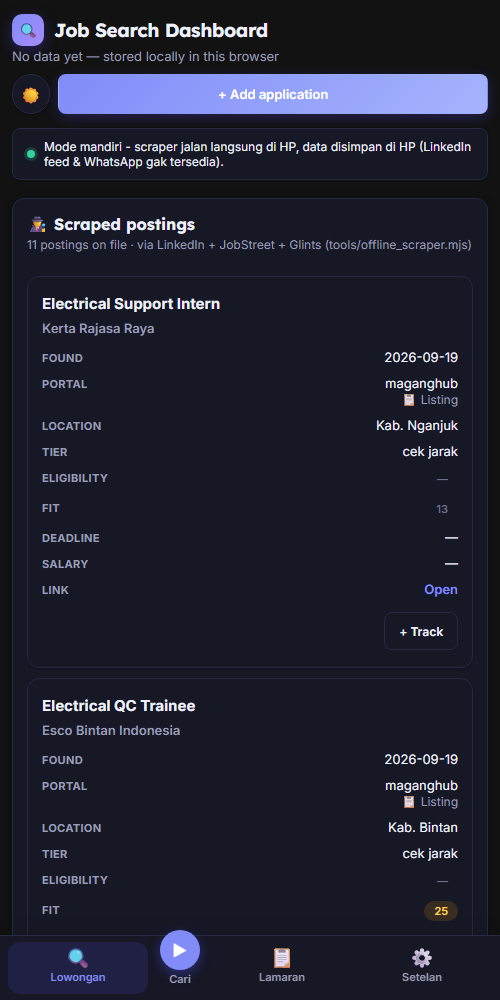
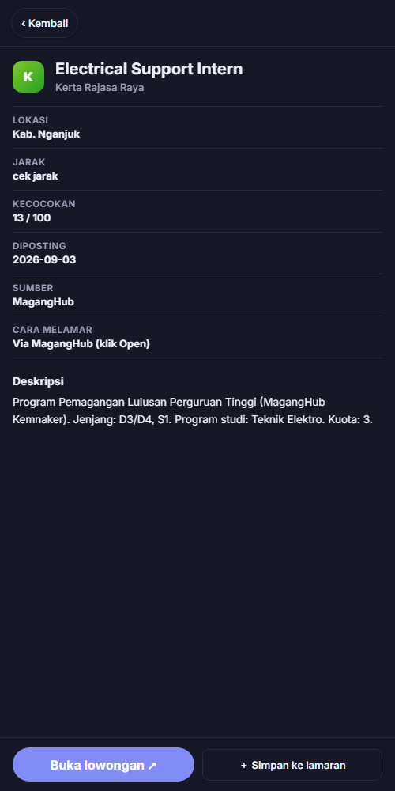
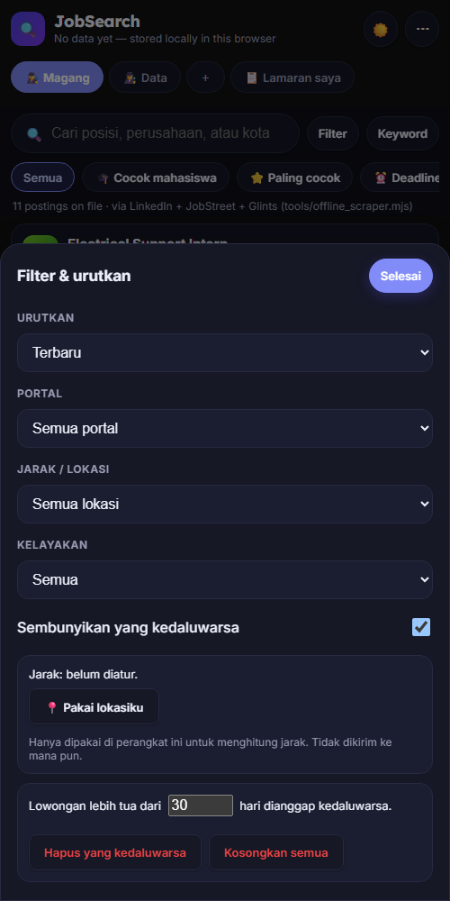
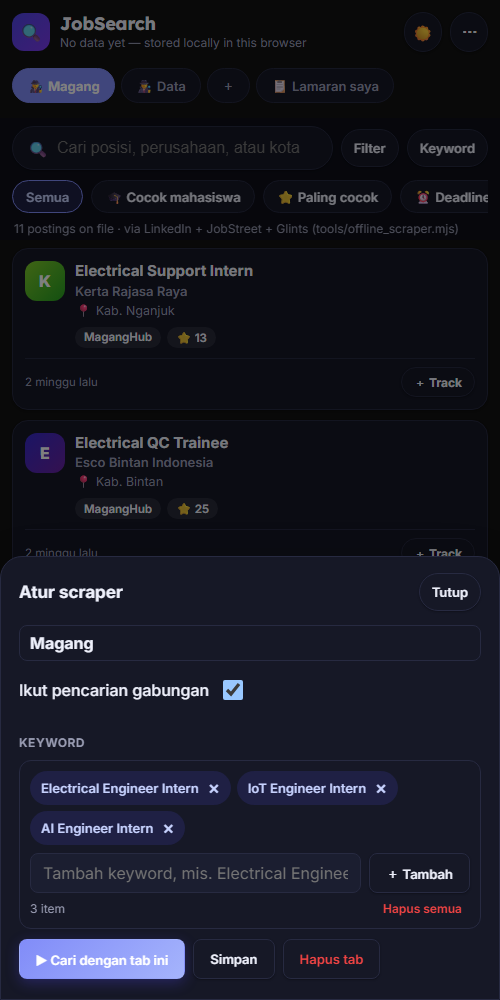
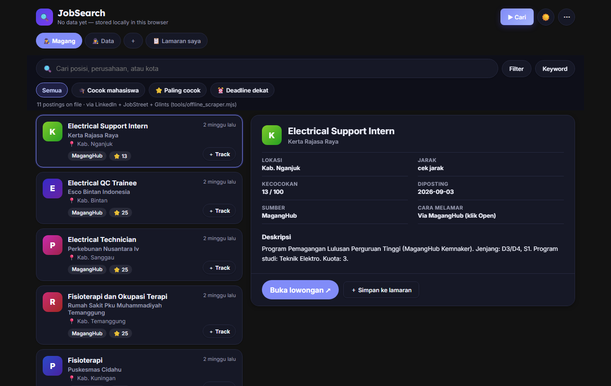
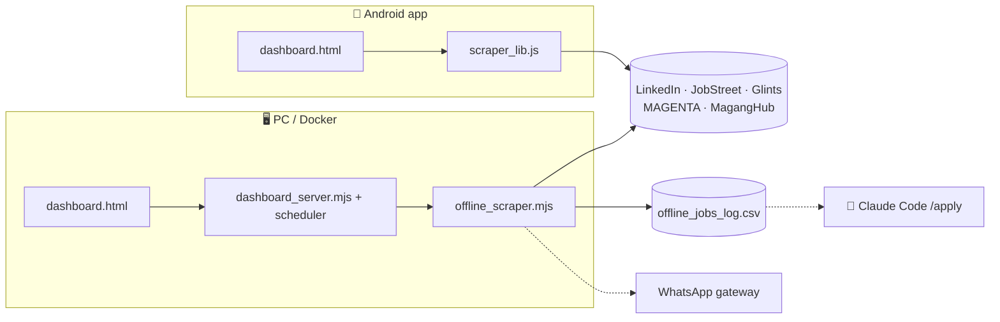

<p align="center">
  
</p>

<h1 align="center">JobSearch Optimalisasi</h1>

<p align="center">
  <em>Cari lowongan magang & kerja di Indonesia dari satu tempat: Android app, dashboard web, atau workflow Claude Code.</em><br>
  LinkedIn · JobStreet · Glints · MAGENTA BUMN · MagangHub Kemnaker
</p>

<p align="center">
  <a href="LICENSE"></a>
  
  
  
  
</p>

<p align="center">
  
  
  
  
</p>
<p align="center">
  
  <br><sub>Data contoh: lowongan publik dari MagangHub. UI yang sama di HP dan desktop (daftar + detail).</sub>
</p>

## Fitur

- **5 portal, 1 daftar:** hasil digabung, dideduplikasi, dan tidak menampilkan lowongan yang sudah kamu lamar.
- **Tab scraper:** satu tab per nama pekerjaan, masing-masing punya keyword sendiri dan tombol Run.
- **Info yang diekstrak:** syarat, deadline, kelayakan mahasiswa/lulusan, skor kecocokan (0-100), jarak ke lokasimu.
- **Jadwal otomatis:** jalan sendiri di jam yang kamu atur (`08:00`, `19:00`, ...).
- **Notifikasi:** pengingat harian dan pemberitahuan lowongan baru di HP; WhatsApp di PC.
- **Pelacak lamaran:** status, statistik, import/export CSV.
- **Ramah pengguna baru:** aplikasi mulai kosong dengan tutorial interaktif 5 langkah (bergerak sendiri saat kamu selesai mengerjakan tiap langkah), input keyword berupa tag, mode gelap/terang. Buka lagi dari menu ⋯ → Panduan penggunaan.
- **Cepat:** semua portal dicari bersamaan dan detail dibaca paralel, jadi pencarian di HP jauh lebih singkat.
- **Output CLI yang jelas:** banner, progres per portal, `[3/34]` saat membaca detail, ringkasan akhir, dan pesan error berbahasa Indonesia dengan saran.

## Tiga cara pakai

| | 📱 Aplikasi Android | 🖥️ Dashboard web | 🤖 Workflow Claude Code |
|---|---|---|---|
| Untuk | Cari dari HP, tanpa PC/server | PC atau Docker yang menyala terus | CV, cover letter, persiapan interview |
| Butuh | HP Android | [Bun](https://bun.sh) atau Docker | [Claude Code](https://claude.com/claude-code), LaTeX |
| Portal | 5 (tanpa LinkedIn feed) | 5 + LinkedIn feed (opsional) | `/scrape`, `/rank` |
| Jadwal | Notifikasi + catch-up saat dibuka | Cron internal server | - |
| Mulai | [`mobile-app/`](mobile-app/README.md) | `tools\open_dashboard.bat` | `claude` lalu `/setup` |

### 📱 Android

Build dari source (JDK 17 + Android SDK), lalu pasang `app-debug.apk`:

```bash
cd mobile-app
node build_www.mjs && npx cap sync android
cd android && gradlew.bat assembleDebug
```

Data tersimpan di HP; scraper berjalan langsung di aplikasi. Android tidak mengizinkan pencarian saat aplikasi benar-benar tertutup, jadi jadwal bekerja lewat notifikasi harian + pengejaran otomatis saat aplikasi dibuka.

### 🖥️ Dashboard web

```bash
tools\open_dashboard.bat        # Windows, buka http://localhost:4870
docker compose up               # atau lewat Docker
```

Server juga bisa dibuka dari HP di jaringan yang sama (`http://<IP-PC>:4870`) dan dipasang sebagai PWA. Scraper tanpa dashboard: `tools\run_offline_scraper.bat`.

### 🤖 Claude Code

```
/setup          # bangun profil
/scrape         # cari + evaluasi
/apply <url>    # CV + cover letter khusus posting
/interview      # paket persiapan
```

Panduan lengkap di [SETUP.md](SETUP.md).

## Sumber lowongan

| Portal | Cara | Catatan |
|---|---|---|
| LinkedIn | jobs-guest API | Tanpa login |
| JobStreet | JSON di halaman pencarian | Bisa kena Cloudflare (pulih sendiri) |
| Glints | JSON di halaman pencarian | Halaman 1 saja |
| MAGENTA (BUMN) | Daftar lowongan + token CSRF | Di PC lewat `curl` (Cloudflare menolak fetch Node/Bun). Di HP belum teruji |
| MagangHub (Kemnaker) | JSON tertanam di halaman | Banyak posisi untuk lulusan; cek badge kelayakan |

Belum ada: Karirhub, MSIB, Ayo Magang Vokasi (belum ditemukan jalur publik).

## Konfigurasi

Semua di `job_scraper/scraper_config.json`, diedit lewat **⚙️ Setelan** di dashboard/aplikasi:

```jsonc
{
  "keywordGroups": [{ "name": "Magang", "enabled": true, "keywords": ["Electrical Engineer Intern"] }],
  "idealLocations": ["surabaya"], "acceptableLocations": ["jakarta"],
  "schedule": { "enabled": true, "times": ["08:00", "19:00"] },
  "maganghubEnabled": true, "magentaEnabled": true
}
```

## Arsitektur



UI yang sama (`tools/dashboard.html`) dipakai di web dan APK; di APK, `standalone.js` menggantikan server dengan API tiruan di dalam halaman.

## Struktur repo

```
tools/          scraper, server dashboard, UI, skrip .bat
mobile-app/     proyek Android (Capacitor 6) + port scraper untuk browser
docs/           referensi lengkap (DETAILS.md)
.claude/        command & skill Claude Code
cv/ cover_letters/   template LaTeX
job_scraper/    data & log lokal (gitignored)
```

Dokumentasi rinci setiap fitur (filter, deteksi kelayakan, WhatsApp, pembersihan data, `.exe`): [docs/DETAILS.md](docs/DETAILS.md).

## Privasi & keamanan

- Data pribadi (`.env`, `job_scraper/`, CV/cover letter hasil, `documents/`) di-gitignore. Jalankan `tools\install_git_hooks.bat` sekali per clone: hook pre-commit memblokir commit yang berisi nomor HP/email aslimu.
- Scraper hanya membaca halaman publik dengan jeda sopan. Fitur LinkedIn feed memakai cookie milikmu sendiri, bersifat opsional, dan melanggar ToS LinkedIn (risiko akun ada di kamu).
- Nilai kecocokan hanyalah tumpang-tindih kata kunci, bukan penilaian nyata. Selalu baca postingnya.

## Kontribusi

Ini workspace pencarian magang pribadi, tetapi PR dan fork dipersilakan.

- Perubahan workflow Claude Code (command, skill, template): ikuti [CONTRIBUTING.md](CONTRIBUTING.md).
- Perubahan tooling (`tools/`, `mobile-app/`): bebas, tulis komentar di kode agar mudah dibaca.
- Jangan pernah meng-commit data kontak, riwayat lamaran, atau kredensial.
- Laporan masalah: cek dulu log run untuk baris `[blocked]` atau `[error]`.

## Kredit

Repo ini adalah **fork/turunan**; kredit tetap kepada penulis aslinya:

| Komponen | Penulis | Lisensi | Peran |
|---|---|---|---|
| [MadsLorentzen/ai-job-search](https://github.com/MadsLorentzen/ai-job-search) | Mads Lorentzen | MIT | Kerangka dasar: `.claude/`, `.agents/skills/`, template CV/cover letter, workflow `/setup → /scrape → /apply` |
| [mikkelkrogsholm/skills](https://github.com/mikkelkrogsholm/skills) | Mikkel Krogholm | lihat repo | Pola CLI skill pencarian kerja yang jadi dasar `.agents/skills/*` |
| [go-whatsapp-web-multidevice](https://github.com/aldinokemal/go-whatsapp-web-multidevice) | Aldino Kemal | MIT | Gateway WhatsApp (Docker, tidak dimodifikasi, dipanggil lewat HTTP) |
| [Capacitor](https://capacitorjs.com) | Ionic | MIT | Pembungkus aplikasi Android |
| [Claude Code](https://claude.com/claude-code) | Anthropic | Proprietary | Agen tempat workflow berjalan |

**Tambahan di fork ini:** scraper offline, dashboard, scheduler, integrasi WhatsApp, portal MAGENTA & MagangHub, aplikasi Android, dan isi profil pribadi di `CLAUDE.md`.

Dibuat oleh [Ahmad Fauzan Prayogi](https://www.linkedin.com/in/ahmad-fauzan-prayogi-39653b1a7/), mahasiswa Teknik Elektro Otomasi, ITS Surabaya. Bukan produk resmi Anthropic.

## Lisensi

MIT, sama dengan upstream: lihat [LICENSE](LICENSE). Notice hak cipta upstream (`Copyright (c) 2026 Mads Lorentzen`) tetap dipertahankan sesuai syarat MIT. Gateway WhatsApp adalah dependensi terpisah dengan lisensi MIT miliknya sendiri dan tidak disertakan di repo ini.
